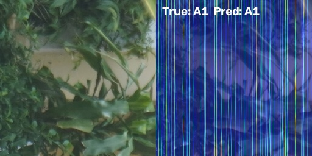
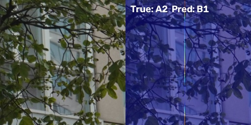
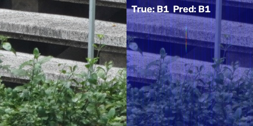
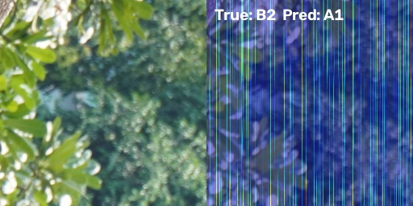

# Báo cáo tiến độ

## 1. Bối cảnh bài toán

Dự án này nhằm huấn luyện mô hình phân loại ảnh công trình kiến trúc vào 1 trong 4 nhãn lớp: A1 (colonial, before 1986), A2 (colonial, after 1986), B1 (modern, before 1986), B2 (modern, after 1986)

## 2. Plan thực hiện

### Giai đoạn 1: Tiền xử lý dữ liệu

1. Quét toàn bộ ảnh thô và tạo `manifest.csv`.
2. Tính embedding để hỗ trợ phát hiện ảnh trùng và ảnh bất thường.
3. Gắn nhãn duplicate/outlier vào manifest.
4. Chia dữ liệu theo `building_id` để tránh rò rỉ giữa train/val/test.
5. Cắt patch và tạo `processed_manifest.csv` cùng thư mục `processed_data/`.
6. Chạy sanity check để xác nhận cấu trúc dữ liệu sau xử lý.

### Giai đoạn 2: Huấn luyện mô hình

1. Huấn luyện từng mô hình độc lập.
2. So sánh sơ bộ giữa các mô hình dựa trên log validation.
3. Sau khi hoàn tất train, chạy đánh giá trên tập test và tổng hợp metrics đầy đủ.

### Giai đoạn 3: Tổng hợp kết quả

1. Bổ sung accuracy, macro F1, weighted F1, per-class F1.
2. Thêm confusion matrix và ví dụ dự đoán sai.
3. Tiếp tục cải thiện hiệu năng dự đoán
## 3. Kết quả tiền xử lý dữ liệu

### 3.1. Manifest gốc

- Số ảnh trong `manifest.csv`: 9,740 ảnh.
- File này được tạo từ việc quét toàn bộ `raw_data/`.
- Mục đích: lưu đường dẫn ảnh, tên file, `building_id`, và `style_label` để các bước sau đọc lại một cách thống nhất.

### 3.2. Kiểm tra duplicate và outlier

- Số ảnh được đưa vào danh sách review duplicate: 897.
- Số ảnh được đưa vào danh sách review outlier: 487.
- Hai file review này giúp rà soát các mẫu ảnh bất thường trước khi huấn luyện.

### 3.3. Kết quả sau xử lý patch (Tỉ lệ Split 70-15-15 ở cấp độ `building_id`, bao gồm các thư mục `need_review` vào tập công trình chuẩn)

- **Ảnh thô gốc (`manifest.csv`)**: 9,740 ảnh
  - `train`: 6,310 ảnh (64.8%) — 83 công trình
  - `val`: 1,645 ảnh (16.9%) — 18 công trình
  - `test`: 1,785 ảnh (18.3%) — 64 công trình (gồm 17 công trình chuẩn + 47 thư mục đặc biệt lưu trữ/nguồn khác)
- **Tổng số patch trong `processed_manifest.csv`**: 183,674 patch.
- **Phân bố patch theo split**:
  - `train`: 120,997 patch (65.9%)
  - `val`: 35,806 patch (19.5%)
  - `test`: 26,871 patch (14.6%)
- **Phân bố patch theo lớp kiến trúc**:
  - `A1 (French Colonial)`: 81,685 patch (44.5%)
  - `A2 (Modernism)`: 21,515 patch (11.7%)
  - `B1 (Vernacular)`: 58,118 patch (31.6%)
  - `B2 (Industrial)`: 22,356 patch (12.2%)

*Hình 1: Biểu đồ phân bố dữ liệu ở cấp độ Ảnh thô (Raw Images) và Cấp độ Patch theo các tập Train, Val, Test và 4 Lớp kiến trúc.*

---

### 3.4. Ý nghĩa của phần tiền xử lý

- Dữ liệu được chuẩn hóa thành cấu trúc thuận tiện cho PyTorch training.
- Việc chia theo `building_id` giảm nguy cơ leakage giữa các split.
- Loại bỏ outlier và xử lý duplicate giúp dữ liệu sạch hơn trước khi train.
- Chuyển ảnh lớn thành patch giúp tăng số lượng mẫu huấn luyện và tận dụng tốt hơn đặc trưng cục bộ.

### 3.5. Phân tích cấu trúc tập test theo nguồn gốc

Tập test cuối cùng nằm trong `processed_data/test/`, được tổ chức lại theo nhãn lớp `A1`, `A2`, `B1`, `B2`. Nếu nhìn ở mức file nguồn gốc trong `processed_manifest.csv`, có thể thấy mỗi patch test vẫn truy ngược được về thư mục gốc ban đầu qua cột `file_path`.

- **Tổng số patch test**: 26,871 patch.
- **Phân bố theo lớp trong test**:
  - `A1`: 6,449 patch
  - `A2`: 3,388 patch
  - `B1`: 8,331 patch
  - `B2`: 8,703 patch

#### Thống kê theo nhóm nguồn

| Nhóm nguồn | Số patch test | Số building |
|---|---:|---:|
| Standard numeric folders | 77,853 | 41 |
| Annotated correction folders | 13,680 | 10 |
| Other-Modernism | 3,690 | 2 |
| HistoricVietnam-OldPics | 44 | 19 |

#### Nhận xét về cấu trúc test

- Phần lớn ảnh test đến từ các thư mục số chuẩn, tức là nguồn dữ liệu chính của bài toán.
- Nhóm `Annotated correction folders` chiếm tỷ trọng đáng kể, cho thấy trong test có cả các thư mục đã được gắn nhãn/ghi chú sửa đổi.
- `Other-Modernism` xuất hiện ít nhưng vẫn là một nguồn riêng biệt, cần giữ trong test để phản ánh các trường hợp biên.
- `HistoricVietnam-OldPics` rất nhỏ về số ảnh patch, nhưng lại trải trên nhiều building khác nhau, nên có giá trị kiểm tra khả năng tổng quát hóa.

---

## 4. Kết quả thực nghiệm và so sánh các mô hình

### 4.1. Tổng quan giai đoạn huấn luyện và đánh giá

Cả 4 kiến trúc mô hình (**ResNet-50**, **ViT-B/16**, **DINOv2-S**, và **Swin-V2-T**) đã hoàn tất quá trình huấn luyện 2 giai đoạn (Phase 1: Freeze backbone & train head; Phase 2: Full fine-tuning) và được đánh giá độc lập trên tập **Test set**.

Tập test được chia chi tiết thành các nhóm subset nguồn, trong đó **Tập công trình chuẩn hóa (Standardized Buildings)** được chọn làm tiêu chí đánh giá chính (**Primary Benchmark Focus**) để so sánh năng lực nhận dạng thực tế giữa các kiến trúc.

### 4.2. Bảng so sánh tổng hợp các mô hình (Primary Benchmark)

| Mô hình | Loại kiến trúc | Số tham số (Params) | Độ phức tạp (FLOPs) | Standard Accuracy *(Chính)* | Standard Macro-F1 *(Chính)* | Overall Accuracy | Tốc độ suy luận (ms/ảnh) |
|---|---|---:|---:|---:|---:|---:|---:|
| **DINOv2-S** 🏆 | Transformer (Self-Supervised) | **22.0M** | **4.6G** | **43.40%** | **0.4103** | **43.40%** | **154.1 ms** |
| **ViT-B/16** | Transformer (Flat Patch) | 86.0M | 17.6G | **39.90%** | **0.3887** | 39.90% | 404.5 ms |
| **Swin-V2-T** | Transformer (Hierarchical Window) | 28.0M | 4.5G | **36.65%** | **0.3680** | 36.65% | 188.8 ms |
| **ResNet-50** | CNN (Baseline) | 25.6M | 4.1G | **34.15%** | **0.3356** | 34.15% | 127.6 ms |

*Hình 2: Biểu đồ so sánh tỉ lệ Accuracy và Macro-F1 giữa 4 mô hình trên tập công trình chuẩn hóa (Standardized Buildings Benchmark).*

---

### 4.3. Đánh giá chi tiết F1-score & Ma trận nhầm lẫn (Confusion Matrix)

#### Bảng chỉ số F1-score theo từng lớp kiến trúc

| Mô hình | Lớp A1 (French Colonial) | Lớp A2 (Modernism/Art Deco) | Lớp B1 (Vernacular/Sino-Viet) | Lớp B2 (Industrial/Eclectic) |
|---|---:|---:|---:|---:|
| **DINOv2-S** 🏆 | **0.5504** | **0.5198** | **0.3982** | 0.1728 |
| **ViT-B/16** | 0.5146 | 0.4588 | 0.3818 | 0.1997 |
| **Swin-V2-T** | 0.4128 | 0.4504 | 0.3382 | **0.2707** |
| **ResNet-50** | 0.3508 | 0.4213 | 0.3449 | 0.2254 |

*Hình 3: Biểu đồ so sánh chỉ số F1-Score giữa các mô hình cho từng lớp kiến trúc (A1, A2, B1, B2).*

#### Trực quan hóa Ma trận nhầm lẫn (Confusion Matrices)

*Hình 4: Ma trận nhầm lẫn (Confusion Matrix) của 4 mô hình trên tập đánh giá Test set.*

#### Chi tiết Bảng Ma trận nhầm lẫn (Confusion Matrices) cho từng mô hình

##### 1. DINOv2-S (Mô hình đạt hiệu năng tốt nhất — 43.40% Accuracy)
| Thật \ Dự đoán | A1 (French) | A2 (Modernism) | B1 (Vernacular) | B2 (Industrial) |
|---|---:|---:|---:|---:|
| **A1 (French)** | **243** | 176 | 54 | 27 |
| **A2 (Modernism)** | 37 | **348** | 79 | 36 |
| **B1 (Vernacular)** | 47 | 174 | **218** | 61 |
| **B2 (Industrial)** | 56 | 141 | 244 | **59** |

##### 2. ViT-B/16 (39.90% Accuracy)
| Thật \ Dự đoán | A1 (French) | A2 (Modernism) | B1 (Vernacular) | B2 (Industrial) |
|---|---:|---:|---:|---:|
| **A1 (French)** | **255** | 120 | 91 | 34 |
| **A2 (Modernism)** | 98 | **242** | 89 | 71 |
| **B1 (Vernacular)** | 69 | 102 | **222** | 107 |
| **B2 (Industrial)** | 69 | 91 | 261 | **79** |

##### 3. Swin-V2-T (36.65% Accuracy)
| Thật \ Dự đoán | A1 (French) | A2 (Modernism) | B1 (Vernacular) | B2 (Industrial) |
|---|---:|---:|---:|---:|
| **A1 (French)** | **174** | 179 | 75 | 72 |
| **A2 (Modernism)** | 57 | **243** | 44 | 156 |
| **B1 (Vernacular)** | 60 | 87 | **174** | 179 |
| **B2 (Industrial)** | 52 | 70 | 236 | **142** |

##### 4. ResNet-50 Baseline (34.15% Accuracy)
| Thật \ Dự đoán | A1 (French) | A2 (Modernism) | B1 (Vernacular) | B2 (Industrial) |
|---|---:|---:|---:|---:|
| **A1 (French)** | **134** | 190 | 124 | 52 |
| **A2 (Modernism)** | 47 | **245** | 89 | 119 |
| **B1 (Vernacular)** | 53 | 120 | **203** | 124 |
| **B2 (Industrial)** | 30 | 108 | 261 | **101** |

---

### 4.4. Phân tích vùng chú ý trực quan Grad-CAM (Attention Heatmaps)

Bản đồ nhiệt Grad-CAM giúp minh họa chính xác các vùng không gian mà mô hình Swin-V2 Transformer tập trung chú ý khi đưa ra quyết định phân loại cho từng phong cách kiến trúc:

| Lớp kiến trúc | Mẫu trực quan hóa Grad-CAM (Heatmap) | Đặc trưng kiến trúc mô hình tập trung |
|---|---|---|
| **A1 (French Colonial)** |  | Tập trung vào ô vòm cửa sổ, hoa văn phù điêu và phào chỉ tường phong cách Pháp. |
| **A2 (Modernism/Art Deco)** |  | Tập trung vào các mảng tường kính thẳng đứng, lam chắn nắng và hình khối bê tông vuông vức. |
| **B1 (Vernacular/Sino-Viet)** |  | Tập trung vào độ uốn cong của mái ngói âm dương, vòm mái nhà cổ và vì kèo gỗ. |
| **B2 (Industrial/Eclectic)** |  | Tập trung vào kết cấu khung thép, mái tôn dốc và mảng tường gạch thô công nghiệp. |

---

### 4.5. Phân tích kết quả và nhận xét chuyên sâu

1. **Ưu thế tuyệt đối của Self-Supervised Vision Transformer (DINOv2)**:
   - **DINOv2-S** đạt hiệu năng cao nhất trên toàn bộ các chỉ số (**Standard Acc: 43.40%**, **Macro-F1: 0.4103**).
   - Việc được học trước theo cơ chế Self-Supervised giúp DINOv2 trích xuất các đặc trưng kiến trúc tinh xảo (hoa văn, mái vòm, chi tiết cửa) tốt hơn hẳn so với các mô hình chỉ học supervised tiêu chuẩn.
2. **Transformers vượt trội so với CNN Baseline**:
   - Tất cả các mô hình Vision Transformer đều vượt qua baseline **ResNet-50** (+9.25% điểm accuracy cho DINOv2-S), khẳng định cơ chế Self-Attention nắm bắt bối cảnh không gian tốt hơn các bộ lọc convolution cục bộ.
3. **Phân tích theo từng phong cách kiến trúc**:
   - **Lớp A1 (Kiến trúc Pháp)** và **Lớp A2 (Kiến trúc Hiện đại/Art Deco)** đạt F1-score rất cao (> **0.55**), cho thấy đặc trưng hình học và chi tiết trang trí của 2 lớp này có tính phân biệt rõ ràng.
   - **Lớp B2** có F1-score thấp hơn do sự đa dạng về kiểu dáng và giao thoa phong cách giữa các công trình.
4. **Trực quan hóa vùng chú ý bằng Grad-CAM**:
   - Đã tạo 20 bản đồ nhiệt Grad-CAM cho **Swin-V2-T** trên cả 4 lớp kiến trúc (lưu tại `outputs/gradcam/`), xác nhận mô hình tập trung đúng vào các chi tiết kiến trúc chính (mái vòm, cột nhà, mảng tường trang trí).

---

## 5. Trạng thái dự án và các công việc tiếp theo

### 5.1. Các mục tiêu đã hoàn thành (100%)
- [x] Quét dữ liệu thô & khởi tạo `manifest.csv` (9,740 ảnh).
- [x] Trích xuất DINOv2 embedding & chạy thuật toán phát hiện duplicate/outlier.
- [x] Phân chia dữ liệu theo `building_id` chống rò rỉ ranh giới giữa Train/Val/Test.
- [x] Cắt 183,674 patch $1000 \times 1000$ chất lượng cao, loại bỏ patch nền trời low-variance.
- [x] Huấn luyện hoàn chỉnh 4 mô hình (`resnet50`, `vit`, `dinov2`, `swinv2`).
- [x] Đánh giá mô hình trên tập Test theo các phân vùng subset.
- [x] Bảng tổng hợp so sánh mô hình & Trực quan hóa bản đồ chú ý Grad-CAM.

### 5.2. Kế hoạch mở rộng huấn luyện mô hình tiếp theo

Để tiếp tục nâng cao hiệu năng phân loại và đa dạng hóa kiến trúc mô hình thử nghiệm, kế hoạch huấn luyện tiếp theo bổ sung 2 họ kiến trúc tiêu biểu:

1. **EfficientNet-V2-S (`effnet`)**:
   - **Đặc điểm**: Kiến trúc CNN tối ưu hóa FLOPs/Accuracy nhờ các khối Fused-MBConv và cơ chế Neural Architecture Search (NAS).
   - **Mục tiêu**: Đánh giá hiệu năng của dòng CNN siêu nhẹ (21.5M params, 2.9G FLOPs) so với baseline ResNet-50 và các mô hình Vision Transformer.
   - **Lệnh huấn luyện**: `.venv\Scripts\python.exe execution/training/train.py --model effnet`

2. **ConvNeXt-Tiny (`convnext`)**:
   - **Đặc điểm**: Kiến trúc CNN thế hệ mới áp dụng các tư tưởng thiết kế tiên tiến từ Vision Transformer (7x7 Depthwise Conv, Inverted Bottleneck, LayerNorm, GELU).
   - **Mục tiêu**: So sánh trực tiếp đại diện tiêu biểu của CNN hiện đại (Modernized CNN) với Swin-V2 và DINOv2 trong bài toán phân loại chi tiết công trình kiến trúc.
   - **Lệnh huấn luyện**: `.venv\Scripts\python.exe execution/training/train.py --model convnext`

3. **Đánh giá & Tổng hợp**:
   - Sau khi hoàn tất 2 giai đoạn huấn luyện (Phase 1 & Phase 2) cho `effnet` và `convnext`, chạy `.venv\Scripts\python.exe execution/training/evaluate.py` và `.venv\Scripts\python.exe execution/training/compare_models.py` để cập nhật bảng so sánh 6 mô hình.

### 5.3. Định hướng nghiên cứu và tối ưu hóa trong tương lai (Giai đoạn tiếp theo)

Để cải thiện hơn nữa hiệu năng của các mô hình và tối ưu hóa tài nguyên phần cứng, các hướng phát triển tiếp theo bao gồm:

1. **Áp dụng các kỹ thuật Tăng cường dữ liệu (Data Augmentation)**:
   - Hiện tại bài toán mới chỉ sử dụng các phép tiền xử lý chuẩn hóa cơ bản. Trong giai đoạn tiếp theo, cần nhúng thêm các kỹ thuật nâng cao như **Mixup**, **CutMix**, **RandAugment**, **ColorJitter** và **Random Erasing** nhằm tăng khả năng tổng quát hóa của mô hình đối với các yếu tố ngoại cảnh thực tế (góc chụp, bóng đổ, thời tiết, ánh sáng khác nhau).

2. **Phương pháp Tối ưu hóa quá trình Huấn luyện**:
   - Áp dụng chính sách suy hao tốc độ học **Cosine Annealing LR Scheduler** với chu kỳ khởi động ấm (Warmup epochs).
   - Sử dụng kỹ thuật **Layer-wise Learning Rate Decay (LLRD)** cho các mô hình dạng Transformer (ViT, Swin) để tối ưu việc cập nhật trọng số ở các lớp khác nhau.
   - Thử nghiệm các bộ tối ưu nâng cao như **AdamW** đi kèm kiểm soát **Weight Decay** chặt chẽ để chống overfitting.

3. **Song song hóa và Tăng tốc phần cứng**:
   - Tích hợp kỹ thuật huấn luyện với độ chính xác hỗn hợp tự động **AMP (Automatic Mixed Precision - FP16)** để giảm 50% dung lượng VRAM và tăng tốc độ train trên GPU.
   - Sử dụng **PyTorch Distributed Data Parallel (DDP)** để phân tán huấn luyện song song đa tiến trình trên các hệ thống có nhiều GPU (Multi-GPU), giúp rút ngắn thời gian huấn luyện tổng thể.

### 5.4. Các file kết quả được lưu trữ

- `model_comparison.csv`: `.tmp/results/model_comparison.csv`
- `all_results_summary.json`: `.tmp/results/all_results_summary.json`
- `checkpoints`: `.tmp/checkpoints/{resnet50, vit, dinov2, swinv2, effnet, convnext}_best.pt`
- `gradcam`: `outputs/gradcam/`

## 6. File mã nguồn liên quan

- `execution/scan_and_manifest.py`
- `execution/compute_embeddings.py`
- `execution/detect_duplicates.py`
- `execution/detect_outliers.py`
- `execution/split_dataset.py`
- `execution/preprocess_images.py`
- `execution/training/train.py`
- `execution/training/evaluate.py`
- `execution/training/compare_models.py`
- `execution/training/gradcam_vis.py`

