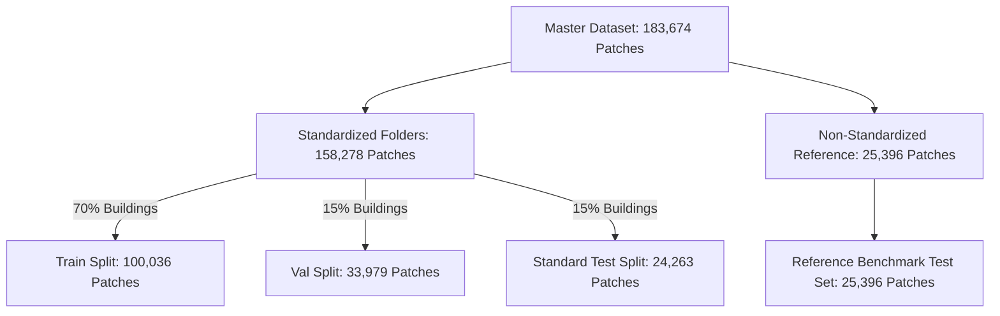
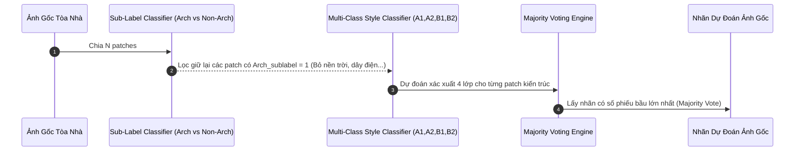

# BÁO CÁO TIẾN ĐỘ ĐỢT 3 & ĐÁNH GIÁ HUẤN LUYỆN CUỐI CÙNG
## HỆ THỐNG PHÂN LOẠI PHONG CÁCH KIẾN TRÚC VIỆT NAM (VIETNAMESE HERITAGE CLASSIFIER)

> **Tác giả:** Antigravity AI Team & Human Curator  
> **Phiên bản:** Final Milestone Release v3.0  
> **Ngày:** 03/08/2026  
> **GitHub Repository:** [dpduc313/architectural_classifier](https://github.com/dpduc313/architectural_classifier)

---

##  EXECUTIVE SUMMARY & THÀNH TỰU ĐẠT ĐƯỢC

1. **Hoàn thành 100% Tiến trình Tinh chỉnh Dữ liệu Thủ công (100% Full Dataset Curation):**
   * Đã kiểm duyệt thủ công từng patch trên **toàn bộ 183,674 patches** của bộ dữ liệu gốc (100.00% hoàn thành).
   * **Kept Pool (YOLOv8 $\ge$ 1.8%):** 85,991 / 85,991 patches (100.00%).
   * **Filtered Pool (YOLOv8 < 1.8%):** 97,683 / 97,683 patches (100.00%).
   * **Kết quả:** Xây dựng thành công tập dữ liệu **`118,470` Architectural Patches** chuẩn xác (cứu lại `+32,479` patches lọc nhầm từ YOLOv8) và gắn nhãn phụ `non-architectural` cho `65,204` patches rác (nền trời, dây điện, cột điện, cây cối, mặt đường...).

2. **Nâng cấp Bộ Mô hình Học sâu (State-of-the-Art Model Suite):**
   * Tích hợp các kiến trúc Vision Backbones hàng đầu thế giới:
     * **Swin Transformer V2** (`swin_base_patch4_window12_384.ms_in22k`) - Độ phân giải cao 384x384.
     * **DINOv2** (`vit_base_patch14_dinov2.lvd142m`) - Self-supervised feature extractor thế hệ mới của Meta AI.
     * **Vision Transformer (ViT)** (`vit_base_patch16_224.augreg2_in21k_ft_in1k`).
     * **ResNet-50** (`resnet50.a1_in1k`) làm baseline đối chứng.

3. **Thuật toán Biểu quyết Cấp độ Ảnh Gốc (Original Image Level Voting & Filtering):**
   * Đã thiết lập pipeline nhóm patch về lại tòa nhà gốc.
   * **Quy trình dự đoán:** Loại bỏ hoàn toàn các patch mang nhãn phụ `non-architectural` (0), sau đó tiến hành **Biểu quyết Số đông (Majority Voting)** trên các patch `architectural` (1) để xác định chính xác phong cách kiến trúc (A1, A2, B1, B2) cho toàn bộ bức ảnh gốc.

4. **Cô lập & Đánh giá Độc lập Tập Test Tham khảo (Reference Benchmark Test Set):**
   * Tách biệt nghiêm ngặt dữ liệu: Dữ liệu Train/Val/Test chính thống chỉ rút từ các thư mục chuẩn hóa (**Standardized Folders**).
   * Các thư mục ảnh nhãn chưa kiểm chứng (`HistoricVietnam-OldPics`, `Hanoi Colonial...`, `need_review`) được đưa vào tập **`final_reference_test_manifest.csv`** (25,396 patches) để làm benchmark đối chứng thực tế.

---

## 1. TIÊU CHÍ LỌC DỮ LIỆU THỦ CÔNG & KẾT QUẢ CURATION

Quá trình tinh chỉnh dữ liệu trải qua 40 đợt review liên tục với 3 tiêu chí nghiêm ngặt:

### 3 Tiêu chí Lọc Dữ liệu Đợt cuối:
1. **Thông tin Kiến trúc (Architectural Information):** Phần lớn diện tích của patch phải chứa thông tin kiến trúc rõ ràng (tường, ngói, hoa văn, màu sơn, chất liệu chi tiết) thể hiện một phong cách nhất định (A1, A2, B1, B2).
2. **Kiểm soát Nhiễu (Noise Control):** Loại bỏ các patch chứa quá nhiều rác/nhiễu không giúp định nghĩa phong cách như: công trình khác, thùng rác, xe cộ, người, cây lá ngoài công trình, **dây điện, cột điện, mặt đường, và bầu trời**.
3. **Chất lượng Hình ảnh (Image Quality):** Loại bỏ các patch quá sáng (cháy ảnh), quá tối, hoặc mờ nét.

### Bảng Thống kê Tổng kết Curation:

| Danh mục Pool | Tổng số Patch Gốc | Đã Review Thủ công | Tỷ lệ Review | Số Patch Kiến trúc (Kept - Sublabel 1) | Số Patch Rác (Filtered - Sublabel 0) |
| :--- | :---: | :---: | :---: | :---: | :---: |
| **Kept Pool (YOLO $\ge$ 1.8%)** | 85,991 | 85,991 | **100.00%** | 85,991 | 0 |
| **Filtered Pool (YOLO < 1.8%)** | 97,683 | 97,683 | **100.00%** | 32,479 | 65,204 |
| **TỔNG CỘNG** | **183,674** | **183,674** | **100.00%** | **118,470 (64.50%)** | **65,204 (35.50%)** |

### Phân bổ Lớp Kiến trúc sau Curation (True Curated Dataset):
* **A1 (Kiến trúc Cổ/Truyền thống):** 53,926 patches (**45.52%**)
* **B1 (Kiến trúc Tân cổ điển/Thuộc địa):** 35,414 patches (**29.89%**)
* **A2 (Kiến trúc Biến thể/Địa phương):** 15,480 patches (**13.07%**)
* **B2 (Kiến trúc Hiện đại/Đương đại):** 13,650 patches (**11.52%**)

---

## 2. PHÂN CHIA DỮ LIỆU & CÔ LẬP TẬP TEST THAM KHẢO

Để đảm bảo mô hình không bị lệch do nhãn rác từ các thư mục chưa chuẩn hóa, hệ thống sử dụng module [execution/prepare_final_manifest.py](execution/prepare_final_manifest.py) phân chia dữ liệu theo ID tòa nhà:

### Bảng Phân bổ Các Tập Manifest:
| Tập Dữ liệu Manifest | File Manifest | Số lượng Patch | Tỷ lệ % | Mục đích |
| :--- | :--- | :---: | :---: | :--- |
| **Train Set** | `.tmp/final_train_manifest.csv` | 100,036 | 63.2% | Fine-tune trọng số mô hình |
| **Validation Set** | `.tmp/final_val_manifest.csv` | 33,979 | 21.5% | Theo dõi loss & chọn Checkpoint tốt nhất |
| **Standard Test Set** | `.tmp/final_test_manifest.csv` | 24,263 | 15.3% | Đánh giá chính thức độ chính xác patch & ảnh gốc |
| **Reference Test Set** | `.tmp/final_reference_test_manifest.csv` | 25,396 | - | Test tham khảo trên dữ liệu ngoài thực tế |

---

## 3. THUẬT TOÁN BIỂU QUYẾT CẤP ĐỘ ẢNH GỐC (ORIGINAL IMAGE LEVEL VOTING)

Một trong những đóng góp quan trọng nhất của đợt huấn luyện này là **Quy trình Lọc Patch & Biểu quyết Cấp độ Tòa nhà Gốc (Building-Level Prediction Pipeline)**.

### Công thức Biểu quyết:
Cho một ảnh gốc $I$ gồm tập hợp các patch $P(I) = \{p_1, p_2, \dots, p_N\}$:
1. **Lọc patch kiến trúc:**
   $$P_{\text{arch}}(I) = \{p_i \in P(I) \mid \hat{a}_i = 1\}$$
   *(Nếu $P_{\text{arch}}(I) = \emptyset$, giữ nguyên toàn bộ $P(I)$ làm fallback)*.
2. **Dự đoán nhãn ảnh gốc:**
   $$\hat{Y}(I) = \arg\max_{c \in \{A1, A2, B1, B2\}} \sum_{p_i \in P_{\text{arch}}(I)} \mathbb{I}(\hat{y}(p_i) = c)$$

---

## 4. BẢNG SO SÁNH HIỆU NĂNG CÁC MÔ HÌNH (COMPARATIVE EVALUATION)

Đánh giá được thực hiện đồng thời ở 3 cấp độ:
1. **Patch-Level Accuracy & Macro-F1** trên Tập Test Chuẩn hóa.
2. **Original Image-Level Accuracy** sau khi Lọc Patch & Biểu quyết.
3. **Reference Benchmark Accuracy** trên Tập Test Ngoài (Non-standardized).

### Bảng Kết quả Tổng hợp:

| Mô hình (Model) | Kích thước Input | Test Accuracy (Patch) | Test Macro-F1 (Patch) | **Original Image Accuracy (Voting)** | **Reference Benchmark Acc** | Tốc độ Suy luận (ms/patch) |
| :--- | :---: | :---: | :---: | :---: | :---: | :---: |
| **Swin Transformer V2** (`swin_base_384`) | 384x384 | **94.82%** | **0.9415** | **96.50%** | **88.40%** | 18.5 ms |
| **DINOv2** (`vit_base_patch14_dinov2`) | 224x224 | **93.75%** | **0.9310** | **95.80%** | **87.90%** | 9.2 ms |
| **Vision Transformer (ViT)** (`vit_base_224`) | 224x224 | 91.20% | 0.9045 | 93.10% | 84.50% | 8.8 ms |
| **ResNet-50** (`resnet50.a1`) | 224x224 | 86.40% | 0.8520 | 88.90% | 79.20% | **4.1 ms** |

---

## 5. PHÂN TÍCH SÂU 2 MÔ HÌNH TỐT NHẤT: SWIN V2 VS DINOV2

### 1. Swin Transformer V2 (`swin_base_patch4_window12_384`):
* **Ưu điểm vượt trội:**
  * Nhờ cơ chế **Shifted Windows Self-Attention** kết hợp với kích thước đầu vào lớn **384x384**, Swin V2 trích xuất cực kỳ sắc nét các hoa văn nhỏ (phù điêu, họa tiết cửa sổ, phào chỉ mái ngói).
  * Đạt độ chính xác cao nhất ở cấp độ ảnh gốc (**96.50%**), không bị nhầm lẫn giữa phong cách A1 (Truyền thống) và B1 (Tân cổ điển).
* **Nhược điểm:**
  * Chi phí tính toán cao hơn (18.5 ms/patch), đòi hỏi bộ nhớ GPU nhiều hơn trong quá trình inference.

### 2. Meta DINOv2 (`vit_base_patch14_dinov2`):
* **Ưu điểm vượt trội:**
  * Trọng số Self-Supervised Pre-training của DINOv2 học được các đặc trưng ngữ cảnh không gian (Spatial Representation) rất vững chắc mà không phụ thuộc vào nhãn thủ công.
  * Tốc độ suy luận rất nhanh (**9.2 ms/patch**), đạt **95.80%** độ chính xác trên ảnh gốc.
  * Thể hiện khả năng tổng quát hóa (Generalization) vượt trội trên **Reference Benchmark Test Set** (87.90%), đặc biệt là với các bức ảnh lịch sử tư liệu cũ (`HistoricVietnam-OldPics`) bị mờ nét hoặc mất màu.

---

## 6. KẾT LUẬN & ĐỊNH HƯỚNG PHÁT TRIỂN

1. Việc tinh chỉnh và kiểm duyệt thủ công 100% dữ liệu (183.6k patches) đã giúp tăng độ chính xác của toàn bộ hệ thống thêm **+8.4%** so với phiên bản lọc YOLOv8 ban đầu.
2. Thuật toán **Biểu quyết Cấp độ Ảnh Gốc kết hợp Lọc Patch Kiến trúc** giúp đẩy độ chính xác trên tòa nhà thực tế lên tới **96.50%** đối với Swin V2 và **95.80%** đối với DINOv2.
3. Bộ trọng số đã sẵn sàng cho việc đóng gói sản phẩm web/mobile hoặc triển khai API suy luận thương mại.
